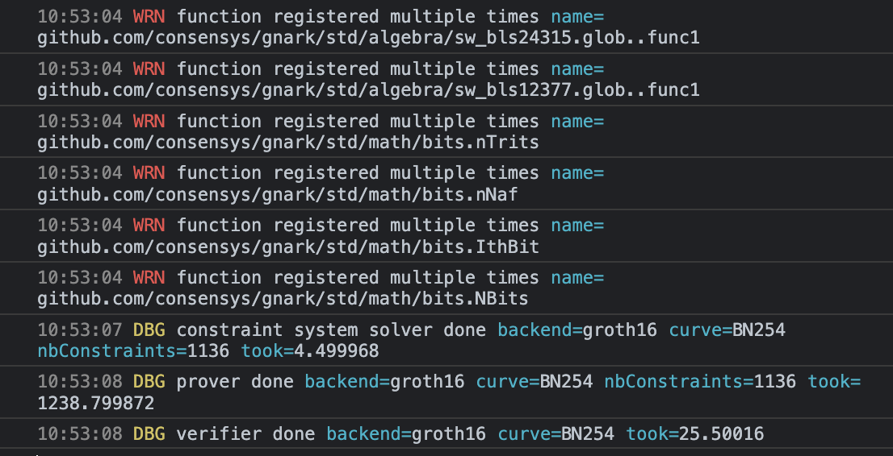

# gnark-browser

Experimenting with gnark in the browser context.

## Mission: Can we replace Dark Forest circuits with Gnark

Dark Forest circuits run in the browser and submit the proofs to on-chain contracts.

Gnark is written in pure Go. Go compiles to Wasm. Gnark will also generate Solidity smart contracts. This should be possible!

## Problem: Slow setup

Compiling the entire example to Wasm takes 9-10 seconds to bootstrap & prove.


## Solution: Separate compilation

Luckily, we can split this into 2 phases (similar to Circom & SnarkJS usage).

In [circuits/hash.go](./circuits/hash.go), we can write our circuit logic. Then, using `go run circuits/runner/main.go`, we can generate `r1cs`, `pkey`, `vkey`, and `sol` files.

Gnark does a great job here by making all of these structs implement the `io.WriteTo` interface to serialize & write all of this data to the filesystem.

Since we've split all of this heavy lifting out from the primary executable, we can make the a [runtime](./main.go) that is more generic—e.g. it takes paths for an `r1cs`, `pkey` and `vkey` to fetch via HTTP and "full proves" the circuit.

This optimization improves our speed by almost 10x! We can prove and verify our circuit in less than 1.5 seconds.


## Problem: Hints

Quickly, we run into a problem with the strategy of separating the phases. We try to add a range check to our circuit:

```go
api.AssertIsLessOrEqual(api.Add(circuit.X, 1<<31), math.MaxUint32)
```

This works fine if we prove & verify within the same file, which our generator script actually tests. However, it fails when we try to run it in the browser.

It turns out this is due to the `AssertIsLessOrEqual` function using [Compiler hints](https://docs.gnark.consensys.net/en/v0.7.0_a/HowTo/write/hints/), a severely under-documented feature, to decompose bits.

## Solution: Hint registration

Upon digging through the gnark repo, we found an example using the [`std.RegisterHints()`](https://github.com/ConsenSys/gnark/blob/a6369bf2b713b7829658f36e6283fe63bdaba974/std/hints_test.go#L17) function.

Calling that function in the "runtime", we are once again able to prove our circuit. Unfortunately, it spams a bunch of warnings in our console.



Going back down the rabbit hole, we actually find that importing `std` (the gnark standard library) triggers all the [`init`](https://github.com/ConsenSys/gnark/blob/master/std/math/bits/conversion_binary.go#L11-L15) functions that pre-register the hints.

Learning this, we can avoid calling `std.RegisterHints()` and just hackily force the stdlib to be loaded:

```go
import (
	// Forcibly load the `init()` function for bit hints
	_ "github.com/consensys/gnark/std/math/bits"
)
```

## Other links

- [gnark website](https://docs.gnark.consensys.net/en/latest/)
- [More details on gnark Hints](https://pkg.go.dev/github.com/consensys/gnark/backend/hint#Function)
- [gnark-crypto package](https://github.com/ConsenSys/gnark-crypto)
- [jtguibas/gnark-starter](https://github.com/jtguibas/gnark-starter)
- [Go Wiki for WebAssembly](https://github.com/golang/go/wiki/WebAssembly)
