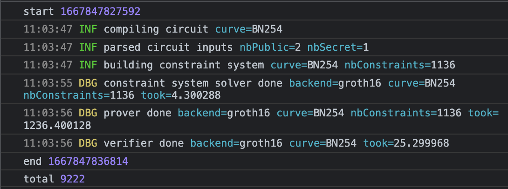
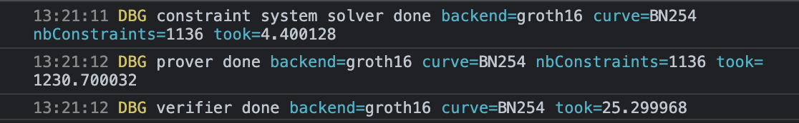

# gnark-browser

Experimenting with gnark in the browser context.

## Mission: Can we replace Dark Forest circuits with Gnark?

Dark Forest circuits run in the browser and submit the proofs to on-chain contracts.

Gnark is written in pure Go. Go compiles to Wasm. Gnark will also generate Solidity smart contracts. This should be possible!

## Problem: Slow setup

Compiling the entire example to Wasm takes 9-10 seconds to bootstrap & prove.



### Solution: Separate compilation

Luckily, we can split this into 2 phases (similar to Circom & SnarkJS usage).

In [circuits/hash.go](./circuits/hash.go), we can write our circuit logic. Then, using `go run circuits/runner/main.go`, we can generate `r1cs`, `pkey`, `vkey`, and `sol` files.

Gnark does a great job here by making all of these structs implement the `io.WriteTo` interface to serialize & write all of this data to the filesystem.

Since we've split all of this heavy lifting out from the primary executable, we can make a [runtime](./main.go) that is more generic—e.g. it takes paths for an `r1cs`, `pkey` and `vkey` to fetch via HTTP and "full proves" the circuit.

This optimization improves our speed by almost 10x! We can prove and verify our circuit in less than 1.5 seconds.



## Problem: Hints

Quickly, we run into a problem with the strategy of separating the phases. We try to add a range check to our circuit:

```go
api.AssertIsLessOrEqual(api.Add(circuit.X, 1<<31), math.MaxUint32)
```

This works fine if we prove & verify within the same file, which our generator script actually tests. However, it fails when we try to run it in the browser.

It turns out this is due to the `AssertIsLessOrEqual` function using [Compiler hints](https://docs.gnark.consensys.net/en/v0.7.0_a/HowTo/write/hints/), a severely under-documented feature, to decompose bits.

### Solution: Hint registration

Upon digging through the gnark repo, we found an example using the [`std.RegisterHints()`](https://github.com/ConsenSys/gnark/blob/a6369bf2b713b7829658f36e6283fe63bdaba974/std/hints_test.go#L17) function.

Calling that function in the "runtime", we are once again able to prove our circuit. Unfortunately, it spams a bunch of warnings in our console.


Going back down the rabbit hole, we actually find that importing `std` (the gnark standard library) triggers all the [`init`](https://github.com/ConsenSys/gnark/blob/master/std/math/bits/conversion_binary.go#L11-L15) functions that pre-register the hints.

Learning this, we can avoid calling `std.RegisterHints()` and just hackily force the stdlib to be loaded:

```go
import (
	// Forcibly load the `init()` function for bit hints
	_ "github.com/consensys/gnark/std/math/bits"
)
```

## Problem: No support for output signals

In Circom, we can produce "output" value and assign it to output signals. Dark Forest uses this to create the `LocationId` and `Perlin` values that are used by the game.

Hypothetically, we could restructure the game client to take extra data produced outside the circuit and verify it to be correct; however, the goal was to do a 1-to-1 swap.

There doesn't seem to be any documentation on why gnark doesn't support output variables.

## Problem: Separate runtime ergonomics

When splitting the circuits from the "runtime", a lot of gnark's assumptions aren't satisfied.

1. Assuming you'll have complete `Circuit`

   You need to have a struct that satisfies the `Circuit` interface to create a witness, but the `Define` function that **must** be defined doesn't actually do anything. This just causes duplication and annoying method stubbing.

2. Unable to unmarshal data for the witness assignment

   It might be related to the complaint above, but trying to unmarshal JSON into a witness assignment in the runtime results in a nil reference panic. Not exactly sure what is causing it. Without this, we can't have a truly generic "full prove" runtime.

3. The hints being loaded awkwardly

   As mentioned in a previous section, having to import a module just to have hints is frustrating because no exports are actually used and Go dev tooling strips unused imports without special syntax.

## Problem: DevEx ergonomics

There are also some issues with just trying to develop circuits with gnark.

1. `frontend.API` threading

   When writing more complex logic, you might want to create separate structs, like [`MiMCSponge`](./circuits/mimc.go), but they need access to `frontend.API` which is auto-injected into the `Define` of a Circuit. You then need to thread this variable into each additional API that needs it, which is often error prone and can lead to nil reference panics.

2. Untyped APIs

   Even though Go now has [Generics](https://go.dev/blog/intro-generics), gnark uses mostly untyped APIs that take `interface{}` (Go's version of `any`). This can lead to many mistakes during development.

3. Stack traces in logging are bad

   When something goes wrong with compiling your Circuit, the stack trace logged is nearly indecipherable. You need to actually log the `err.Error()` to get a readable stack trace, so why even log the bad version?

   

## Problem: Size

Even though we can separate the circuit compilation from the "runtime" for quick bootstrapping, the size of that runtime is still massive—20 megabytes!


### Solution(???): TinyGo

The common solution to large Wasm modules produced by Go is to reach for [tinygo](https://tinygo.org/docs/guides/webassembly/), but we get a failure when trying to compile our gnark runtime with it:

```
# encoding/gob
/go/1.19.3/libexec/src/encoding/gob/decode.go:562:21: MakeMapWithSize not declared by package reflect
```

I believe this is due to TinyGo not supporting the encoding & decoding libraries in Go's standard library, so it'd be ideal if gnark used a compatible serde library instead.

## Other links

- [gnark website](https://docs.gnark.consensys.net/en/latest/)
- [More details on gnark Hints](https://pkg.go.dev/github.com/consensys/gnark/backend/hint#Function)
- [gnark-crypto package](https://github.com/ConsenSys/gnark-crypto)
- [jtguibas/gnark-starter](https://github.com/jtguibas/gnark-starter)
- [Go Wiki for WebAssembly](https://github.com/golang/go/wiki/WebAssembly)
